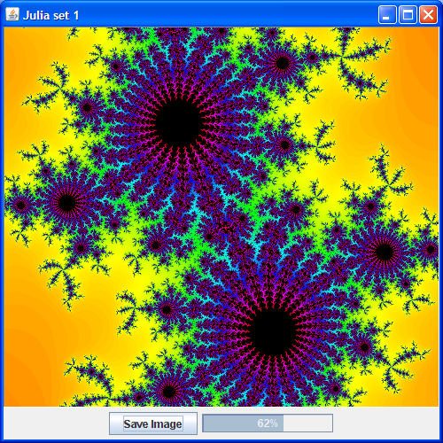

#**Ad-hoc Networking**
##Team Infinite Tuples
Distributed fractal generator for use on an Ad-hoc network. Makes use of Professor Kaminsky's [Tuple Board Library](http://www.cs.rit.edu/~ark/tb.shtml).

Julia Fractal Screenshot:

**Report 1** [PDF](Report1.pdf) | [ODP](Report1.odp) | [PPT](Report1.ppt)

**Report 2** [PDF](Report2.pdf) | [ODP](Report2.odp) | [PPT](Report2.ppt)

**Report 3** [PDF](Report3.pdf) | [ODP](Report3.odp) | [PPT](Report3.ppt)

**Report 4** [PDF](Report4.pdf) | [ODP](Report4.odp) | [PPT](Report4.ppt)

**Final Report** [PDF](Infinite_Tuples_Final_Report.pdf)

**UML Diagrams** [Overview](Overview_UML.png) | [Control Panel](Control_Panel_UML.png) | [Create Problem](Create_UML.png) | [Solving a Problem](Solve_UML.png)

**Project JAR File** [JAR](IT_Team_Project.jar)
