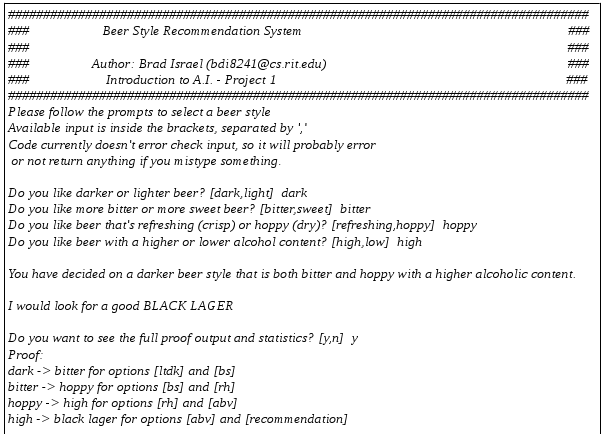

#**Artificial Intelligence**
##Beer Style Expert System
The artificial intelligence system that I chose to implement for this project is a recommendation system, that is 
designed to help thirsty people choose the style of beer that best suits their personal tastes. As a 
recommendation system, it is a type of expert system that is used in quite a few real-world applications, 
such as Amazon's online store recommendation system, which helps users find products that are related to products 
they have looked at or bought in the past. My system is much more simplistic than something like Amazon's, but it 
does demonstrate the power of using a rule and fact based system over the traditional conditional statements. 
After the initial overhead of setting up the rules, adding, modifying, or removing rules became very simple and 
flexible because the rules code was completely separated from the control and fact code.

The project was implemented in Python, using the Pyke library. All of the installation, setup, and executing information can be found in the code zip file.   
Report: [PDF](pr1_bdi8241.pdf)

Code: [ZIP](pr1_bdi8241.zip)

Demo Screenshot:

