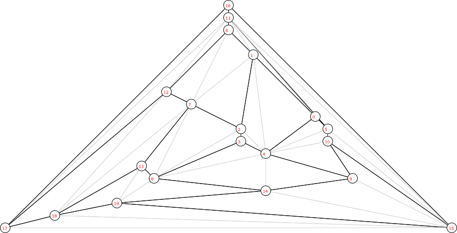
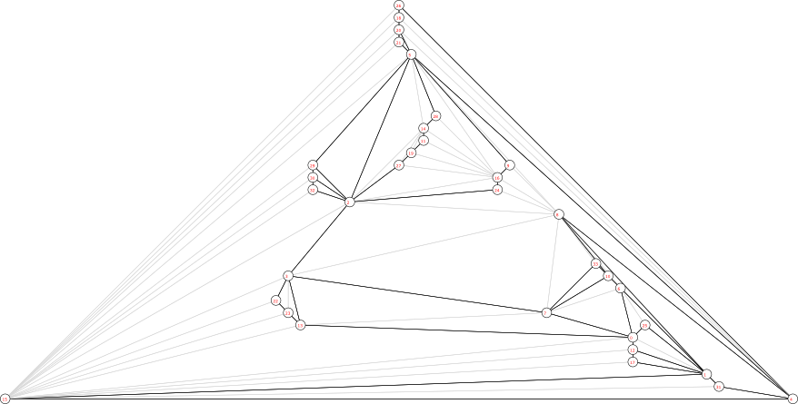

#**Theory of Computer Algorithms**
## Planar Graph Detection and 2D Embedding
Implementation of an algorithm that checks if the graph is a planar graph and if it is, embeds it on a 2d space. The output of the code is a SVG picture of the graph. I suggest using Inkscape to view the images properly because some of them are very large.  

Download the code [here (JAR)](DrawGraph.jar)

Sample output graphs: [ZIP](sample_output_graphs.zip)

Graph Output: 
(Dark lines are the original edges in the graph. Light lines represents the connected graph edges.)

P14 - Planar graph with 20 nodes:

P33 - Planar graph with 33 nodes:

