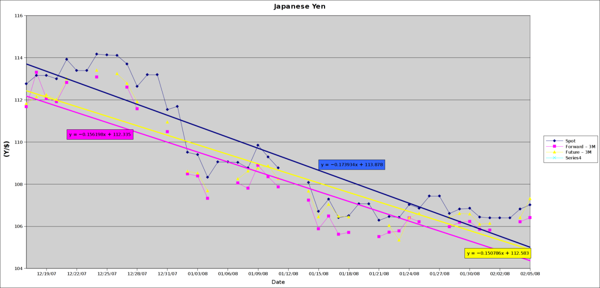

#**International Finance**
##Forecasting the Future of the Japanese Yen
Analysis of the Japanese yen for my International Finance course. Attempts to predict the future spot exchange rate of 
the yen based on short-term historical trends and macro economic indicators. Uses the long and short-term predictions 
to try and show arbitrage and hedging possibilities. 

Known Spot rate for 02/05/2008: (Y)107.02/$

Predicted 3-Month Spot rate for 05/05/2008: (Y)112/$

Actual Spot rate for 05/02/2008: (Y)105.09/$

Predicted 3-Month Spot rate for 02/05/2009: (Y)118/$

Actual Spot rate for 02/05/2009: (Y)91.82/$

[Report](Currency_Project.pdf)
[Excel Data and Analysis](yen_data_and_analysis.xls)

*Data Trends for data collected from December 2007 through February 2008:*

