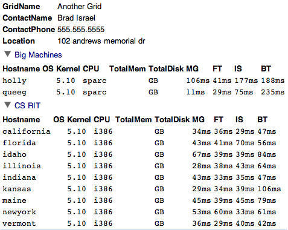
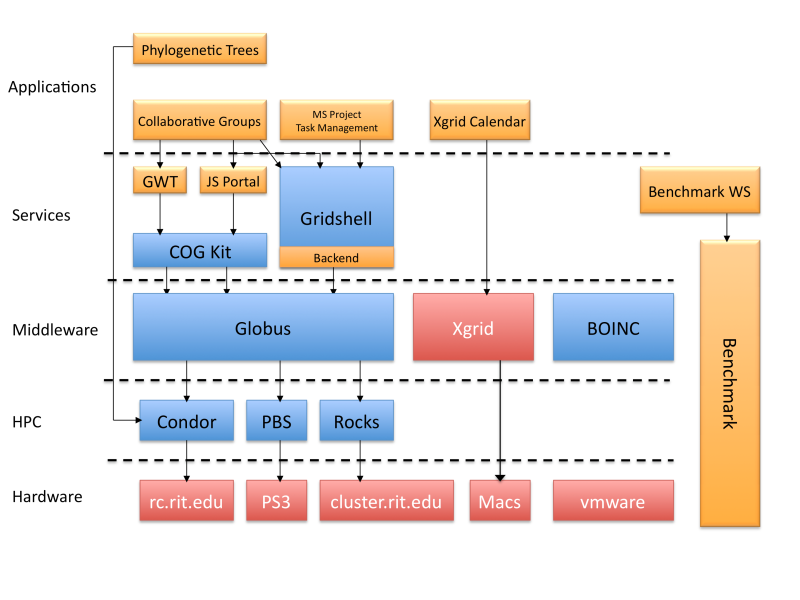

#**Grid Computing**
##Comparing Performance of Algorithms on Diverse Clusters
Our project attempts to setup an easily accessible and extensible platform for analyzing a grid's computational 
performance. A Java web service is used to both collect and display results and a standalone Java application is 
used, by the end user, to gather individual system and grid information and benchmark results. The gathered data 
is finally shared through the web service's display interface, so that others can compare grids together to find 
the optimal one for their problem.

Final Paper: [PDF](final.pdf)

Presentation: [PDF](presentaion.pdf)

Code: [ZIP](cyberaide-webprojects.zip)

Main SVN for the entire class: [http://cyberaide.googlecode.com/svn/trunk/](http://cyberaide.googlecode.com/svn/trunk/)

Web interface screenshot:

Picture of how our class's projects fit together:

