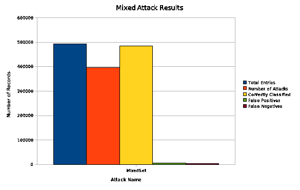

#**Intelligent Secure Systems**
##Using a Joone Neural Network for Intrusion Detection
Intrusion Detection Systems (IDS) are designed to classify activity in order to differentiate between legitimate and 
illegitimate use of a computer or network. An IDS may monitor any type of activity, but a common type of activity to 
monitor is network traffic. An intrusion detection system which monitors network activity is called a Network-based
Intrusion Detection System, or NIDS. Network traffic is relatively easy to capture and any intrusion from a remote 
machine should be present in a comprehensive log of the network activity. The problem that an NIDS attempts to solve 
is finding the traffic which should be classified as illegitimate activity and reporting it appropriately.

Finding illegitimate activity is a very difficult problem in most cases. Since a network is used for many diverse 
tasks, many times illegitimate traffic very closely resembles legitimate traffic. In this project we examine the
application of neural networks to the problem of classification of traffic.

Final Paper: [PDF](Project3_Brad_Israel_Jon_Ludwig.pdf)

Code: [JAR](NNIds.jar)

Results:

