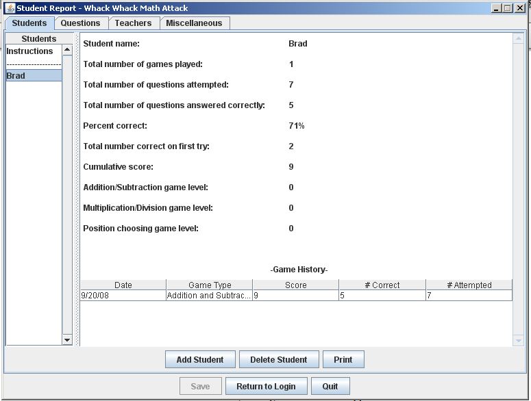

#**Software Engineering**
##Whack Whack Math Attack
Whack Whack Math Attack is a network-enabled children's math game that can help younger students learn to 
add/subtract, multiply/divide, and units places. This project was done as a small group of 5 people and was 
designed, tested, programmed, and packaged in 10 weeks. Our group worked together using group meetings for 
design tasks and CVS for group programming. The result was an extremely successful end product, that met or 
exceeded all of our expectations and serves as a great example of our software engineering ability. Take a look 
at the screenshots below to get a feel for the game and then feel free to download the Windows installer or 
source code to run it yourself!

Final Presentation: [PPT](R3_presentation.ppt)

Windows Installer: [MSI](WhackAMathR3.msi) *Requires Sun Java JRE 1.5 or higher

Install and Usage Document: [PDF](Readme.pdf)

Java Source Code: [ZIP](WhackAMathR3.zip)

Project Requirements: [DOC](Requirements.doc)

Product Design: [DOC](ProductDesign.doc)

UML Design: [Game Logic UML](R2_GameLogicUML.png) | [Game UI UML](R2_GameUIUML.png) | [Database UML](R2_databaseUML.png) | [Administration UML](R2_administrationUML.png)

Screenshots:

Student Login Screen

Student Login Screen - Choose game

Game Instructions

Student Game Play

Student Game Play - Correct Answer

Student Game Play - Incorrect Answer

Student Game Play - Get a certificate of progress at the end of the game

Administration Screen - Adding/Modifying Questions

Administration Screen - Student Progress

School Board Class Viewer

